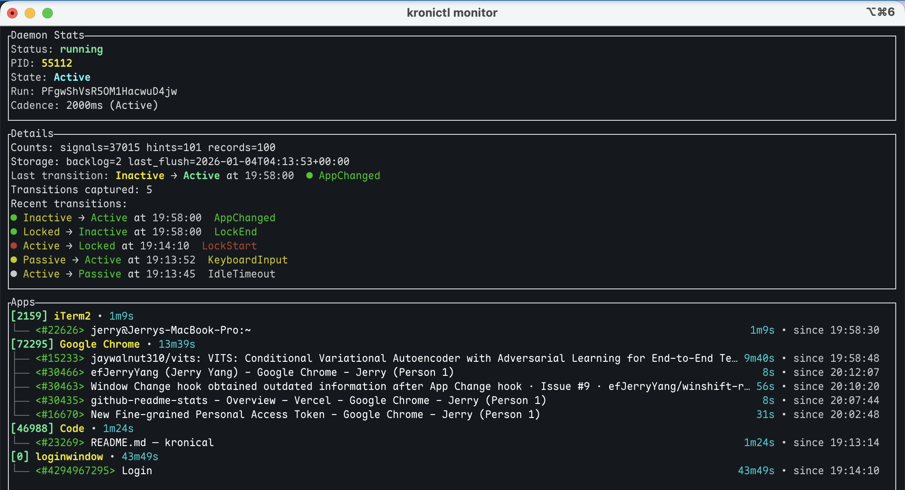

# Kronical

Kronical is a local activity-tracking service. The daemon (`kronid`) observes
system hooks, derives higher-level signals, and writes activity records that
clients can consume over HTTP/gRPC.

This repository focuses on the service side: hook ingestion, signal-driven
state machine, compression, and storage backends. UI layers can build on the
snapshot endpoints described below.

## Architecture Notes

See `docs/arch.md` for the current pipeline topology, signal/hint derivation,
and storage hydration details.

## Repository Layout

- `crates/common/` - shared utilities.
- `crates/core/` - domain logic and snapshot bus.
- `crates/storage/` - storage facade plus integration tests under
  `crates/storage/tests/`.
- `src/daemon/` - runtime wiring: coordinator, pipeline, compressors, API
  surfaces, trackers.
- `src/bin/` - service binaries (`kronid`, `kronictl`).
- `docs/` - architecture notes and design documents.

## Getting Started

Install it from source (`kronictl`, `kronid`):

```bash
cargo install --path .
kronictl start   # launches the daemon, can optionally pass `--run <run_id>`
kronictl status
kronictl restart # restarts the daemon with same run_id
kronictl stop    # stops the daemon
```

All configs, logs and databases are stored under `~/.kronical`, you can simply delete that folder to reset the state.

`kronid` requires macOS Accessibility + Screen Recording permissions to capture
input events and window titles. Without them the daemon will exit early or
return empty focus data.

### Example Outputs

```txt
❯ kronictl status
Kronical Status Snapshot - 2026-01-03 20:14:40 -08:00
═════════════════════════════════════════════════════════════

Kronical Daemon:
  State: Active
  Run: PFgwShVsR5OM1HacwuD4jw
  Focus: iTerm2 [2159] - jerry@Jerrys-MacBook-Pro:~
  Cadence: 2000ms (Active)
  Counts: signals=37833 hints=106 records=105
  Next timeout: 2026-01-04 04:14:42.507038 UTC
  Storage: backlog=3 last_flush=2026-01-04T04:14:36+00:00

Tip: Use 'kronictl monitor' for real-time updates
```

<!-- insert a screenshot of monitor -->


See [docs/demo-snapshot.md](docs/demo-snapshot.md) for an example snapshot captures.

### Useful `kronictl` commands

- `kronictl start|stop|status|restart` - daemon lifecycle.
- `kronictl snapshot [--pretty]` - fetch the latest snapshot via HTTP.
- `kronictl watch [--pretty]` - follow snapshot updates (SSE).
- `kronictl monitor` - interactive terminal UI (press `q` to quit).
- `kronictl tracker show [--watch]` - inspect system-tracker metrics when the
  tracker is enabled in config.

## Snapshot Endpoints

HTTP (Unix socket):

- `GET /v1/snapshot` -> JSON snapshot
- `GET /v1/stream` -> SSE stream of snapshots
- Example (curl):
  ```sh
  curl --unix-socket ~/.kronical/kroni.http.sock http://localhost/v1/snapshot
  ```

gRPC (Unix socket):

- `Snapshot` -> snapshot payload
- `Watch` -> streaming snapshots
- `GetSystemMetrics` -> system tracker metrics
- Example (grpcurl):
  ```sh
  grpcurl -plaintext -import-path proto -proto proto/kroni.proto unix:///Users/jerry/.kronical/kroni.sock kroni.v1.Kroni/Snapshot
  ```

Snapshot payloads include current state, focus, cadence, counts, `run_id`,
recent transitions, aggregated app/window durations, and the full in-memory
`records` list for the same run ID within the retention window.

Snapshot/stream payload coverage:

| Endpoint | Transport | Delivery | Payload | Notes |
| --- | --- | --- | --- | --- |
| `GET /v1/snapshot` | HTTP (UDS) | one-shot | JSON snapshot | Latest snapshot for the current run ID within retention. |
| `GET /v1/stream` | HTTP SSE (UDS) | stream | JSON snapshot | Starts with the current snapshot, then emits updates. |
| `Snapshot` | gRPC (UDS) | one-shot | `SnapshotReply` | Same snapshot data as HTTP. |
| `Watch` | gRPC (UDS) | stream | `SnapshotReply` | Starts with the current snapshot, then emits updates. |

## State Machine

The event pipeline produces a deterministic state machine:

- States: `Active`, `Passive`, `Inactive`, `Locked`.
- Transitions respect `active_grace_secs` (default 30s) and
  `idle_threshold_secs` (default 300s).
- While locked, we emit lock/unlock signals and suppress raw input persistence.

State transition table:

| From             | Trigger                         | Guard/Condition                    | To                      |
|------------------|---------------------------------|------------------------------------|-------------------------|
| Any              | LockStart                       | —                                  | Locked                  |
| Locked           | LockEnd                         | Determine post-unlock state        | Active/Passive/Inactive |
| Inactive/Passive | Keyboard/Mouse/App/Window/Pulse | —                                  | Active                  |
| Active           | Tick                            | no input for `active_grace_secs`   | Passive                 |
| Passive          | Tick                            | no input for `idle_threshold_secs` | Inactive                |

## Configuration

User configuration lives at `~/.kronical/config.toml`. Every field can be
overridden with a `KRONICAL_` environment variable (for example,
`KRONICAL_TRACKER_ENABLED=true`). Relevant knobs include workspace paths,
retention, state thresholds, tracker cadence, and cache sizes. See
`crates/common/src/config.rs` for the full schema.

## Storage Backends

DuckDB is the default backend; SQLite remains available for lightweight setups.
Each backend runs in its own thread, draining persistence commands, committing
in batches, and reporting backlog metrics via the snapshot bus. The shared
logical schema covers `raw_events`, `raw_envelopes`, `activity_records`,
`compact_events`, and `recent_transitions`. Raw event identifiers embedded in
compact records use `kronical_core::compression::RawEventPointer`, which stores
the source table name so debug captures can live alongside the default
`raw_events` table without dangling references. Integration tests under
`crates/storage/tests/` validate command execution, health reporting, and data
round trips.

## Compression

`crates/core::compression` converts persisted raw events into compact summary
records. The engine maintains alignment by recording contributing raw event IDs
alongside structured payloads for scroll bursts, mouse trajectories, keyboard
activity, and focus transitions, using optional `RawEventPointer` metadata when
those debug records are retained.

## Development Workflow

- Prefer crate-scoped test runs (`cargo test -p kronical-core`,
  `cargo test -p kronical-storage`, ...) to keep failures focused.
- Tests must exercise observable behavior (state transitions, channel hand-offs,
  storage writes) rather than tautological assertions.
- `make coverage` runs `cargo llvm-cov` with colorised output, writes
  `coverage/summary.txt`, and generates the HTML report under
  `coverage/html/`.
- Use `FEATURE_FLAGS="--features hotpath"` during `make` invocations to enable
  optional profiling hooks, keeping runs single-threaded when necessary.

## Permissions Checklist (macOS)

- Accessibility - required for global input hooks.
- Screen Recording - required for window title capture.

Grant both permissions to `kronid` (or the terminal hosting it) before starting
the daemon.

## Support & Next Steps

Active work targets pipeline coverage, storage verification, and UI consumers
of the snapshot endpoints. See `docs/arch.md` for internals.
